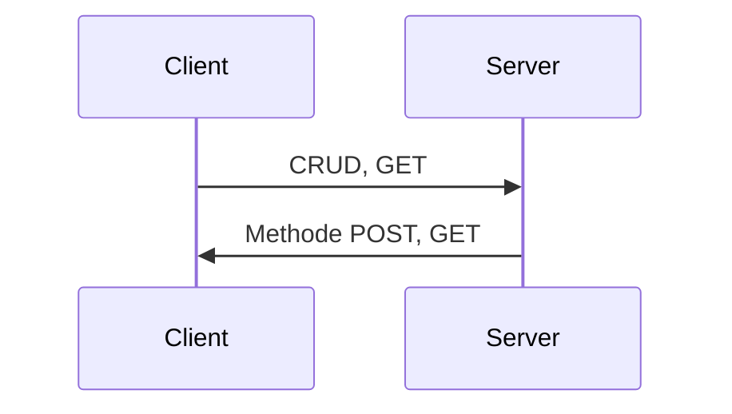

# Bienvenue sur notre site e-commerce!

Bonjour, nous sommes un groupe de deux étudiants qui ont crées notre site de vente en ligne  **BShopping**.  Nous devions lors de ce projet répondre à des objectifs fixés. Nous avions mis en place une application en ***node js et Express*** côté server et utilisés le framework *VUE.JS*.
Mais pour répondre à l'ensemble des objectifs, nous devions mettre en place des méthodes CRUD (**create**, **rename**, **update** et **delete**), ainsi qu'un menu responsive. Pour la partie CRUD, nous ne devions pas utiliser une base de donnée mais nous avions la possibilitée de stocker nos données dans un json ou une liste javascript. A la suite de ça, le site possède également un système d'authentification, avec login et mot de passe, ainsi que des cookies pour les sessions. Pour le mot de passe nous avons également **crypté** son contenu pour rendre notre site un peu plus sûre.

# Lancer notre projet

Deux façons de l'exécuter:
-
Sous Unix / Linux:
- 
- **"node app.js"**

Sous Windows:
- 
- ***"set DEBUG=* & npm start"**

> **Note:**  Si vous n'arrivez pas à lancer le projet contactez-moi, sur nos boîtes mail: verdy@et.esiea.fr, nesaratnam@et.esiea.fr
> 

# Se connecter en admin

Id
-  **"toto"**
Mdp
-  **"titi"**

*Echange entre le côté client et le côté serveur:*

